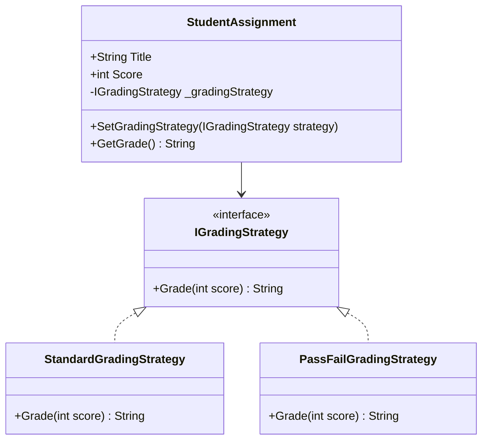

# Behavioral Design Patterns - E-learning Platform

Acest document descrie cele 5 paternuri de proiectare comportamentale implementate în aplicația E-learning, alături de modul de funcționare și avantajele acestora.

## 1. Strategy Pattern

**Ce problemă rezolvă?**
Permite definirea unei familii de algoritmi, încapsularea fiecăruia și transformarea lor în componente interschimbabile la rulare. Evită utilizarea unor instrucțiuni decizionale complexe (`if/else` sau `switch`) pentru schimbarea comportamentului.

**Cum a fost aplicat?**
A fost aplicat pentru sistemul de evaluare a temelor (Grading).
Interfața `IGradingStrategy` a fost creată pentru a defini contractul comun de evaluare, iar clasele `StandardGradingStrategy` (note literale A, B, C etc) și `PassFailGradingStrategy` (Admis/Respins) oferă variații de algoritm. Clasa de context `StudentAssignment` utilizează interfața și poate schimba strategia oricând, prin metoda `SetGradingStrategy`.

**Beneficii:**
- Izolarea logicii de evaluare din clasa `StudentAssignment`.
- Adăugarea ușoară a altor strategii (ex: `CurvedGradingStrategy`) fără a modifica codul existent.

## 2. Observer Pattern

**Ce problemă rezolvă?**
Definește o dependență unu-la-mai-mulți între obiecte, astfel încât, atunci când un obiect își schimbă starea, toți dependenții săi sunt notificați și actualizați automat.

**Cum a fost aplicat?**
În platforma e-learning, studenții (Observers) sunt notificați când un curs (Subject) adaugă un nou material.
Am creat `ICourseObserver` pentru clasa `StudentObserver` și `ICourseSubject` care este implementat de `CourseNotifier`. Când `CourseNotifier` adaugă un material (`AddNewMaterial`), acesta invocă funcția `Notify()` informând toți abonații din listă.

**Beneficii:**
- Suport robust pentru un sistem de broadcast (notificare a tuturor instanțelor interesate din platformă).
- Subiectul (`CourseNotifier`) și Observatorul (`StudentObserver`) nu depind unul de structura celuilalt, asigurând un decuplaj perfect.

## 3. Command Pattern

**Ce problemă rezolvă?**
Încapsulează o cerere ca și un obiect, permițând parametrizarea cu diverse cereri, plasarea lor într-o coadă (queue), logging-ul și furnizarea unor operațiuni ce pot fi anulate (Undo/Redo).

**Cum a fost aplicat?**
A fost utilizat pentru mecanismul de înrolare/retragere al unui student la un curs.
Interfața `ICommand` solicită metodele `Execute()` și `Undo()`. Comanda concretă `EnrollCommand` execută înrolarea, iar actul de "Undo" apelează metoda opusă (retragerea de la curs din Receiver). Clasa `CommandInvoker` memorează un istoric (un `Stack<ICommand>`) permițând anularea oricărei cereri efectuate prin `UndoLastCommand()`.

**Beneficii:**
- Decuplarea emițătorului cererii (Invoker) de obiectul care știe să o execute (Receiver - `CourseManagerReceiver`).
- Permiterea implementării unor caracteristici vitale în platforme moderne: Undo, Log-uri de acțiuni.

## 4. Memento Pattern

**Ce problemă rezolvă?**
Permite fixarea și externalizarea stării interne a unui obiect, putând restaura mai târziu obiectul în respectiva stare fără a viola încapsularea.

**Cum a fost aplicat?**
Implementat pentru a salva versiuni sau schițe ale unor teme sau descrieri de curs.
Clasa `AssignmentDraftOriginator` (reprezentând starea internă curentă) are metode precum `SaveDraft()`, creând un obiect de tip `AssignmentDraftMemento` care este doar un "snapshot" al temei curente. Clasa `DraftHistoryCaretaker` acționează ca "administrator", stocând backup-urile fără a avea acces și permisiuni să modifice datele sensibile din memento.

**Beneficii:**
- Respectă starea de încapsulare, deoarece niciun alt sistem nu știe detalii despre cum este format `Memento`.
- Facilitează o infrastructură flexibilă pentru "Autosave" / "Version Control" pentru scrierea conținutului text din curs.

## 5. Iterator Pattern

**Ce problemă rezolvă?**
Oferă un mod standard și secvențial de parcurgere a elementelor dintr-un set "agregat" de obiecte, respectând încapsularea asupra modului în care colecția este implementată intern (de exemplu o listă, arbore, dicționar).

**Cum a fost aplicat?**
Pentru cursurile în care materialele / modulele variază foarte mult. Avem clasa de bază `CourseModule` (pentru modulele structurii cursului). Am implementat o colecție de tip `CourseModuleCollection` care maschează intern tipul de stocare și apelează la interfața `IAggregate<T>` pentru a întoarce un obiect instanță din clasa `CourseModuleIterator`, ce este o compatibilitate pentru `IIterator<T>`.

**Beneficii:**
- Curăță colecțiile e-learning de parcurgeri dependente de detalii structurale interne.
- Simplifică iterarea chiar și prin structuri ierarhice complexe folosind o singură interfață generică standard `HasNext()`, și `Next()`.
