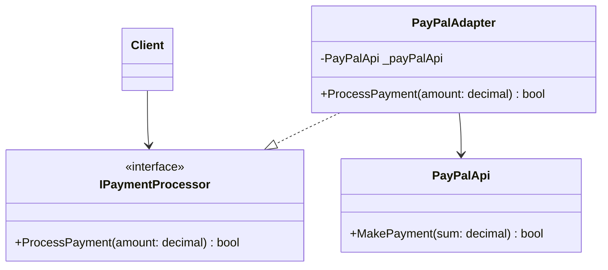
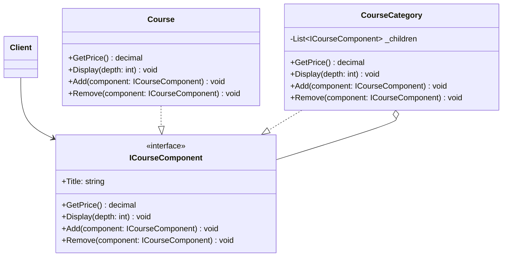
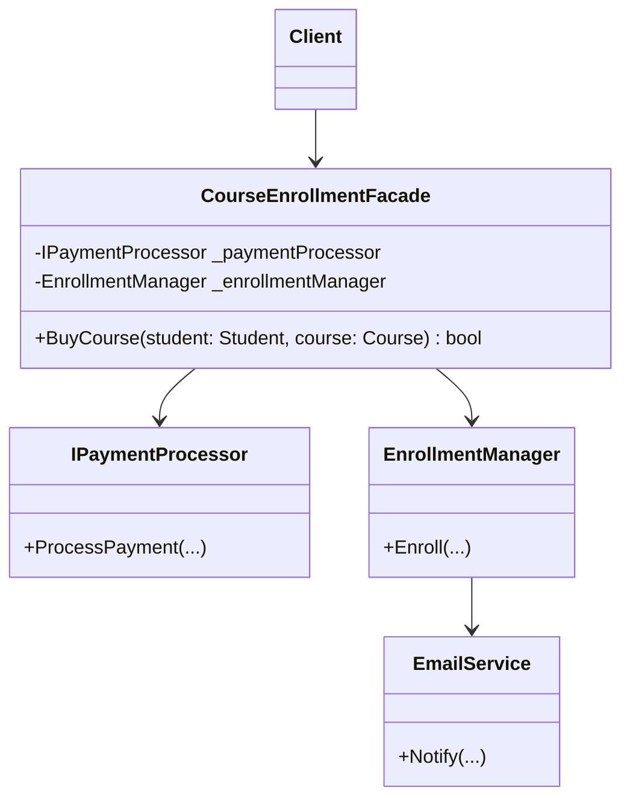
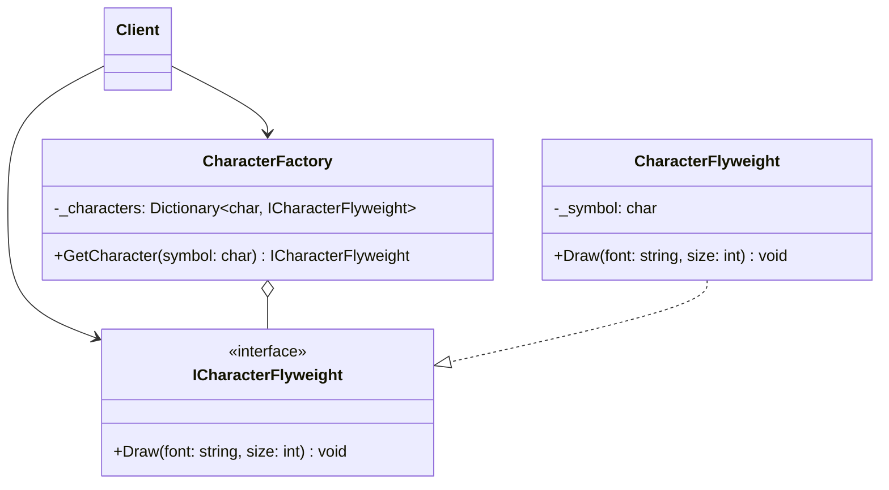
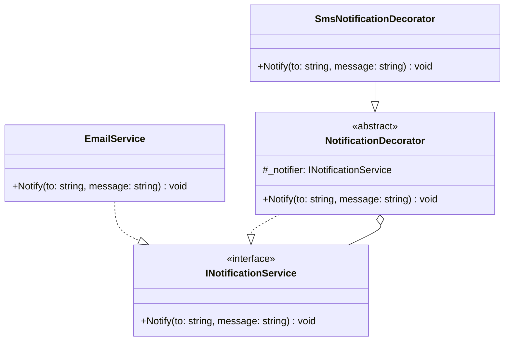
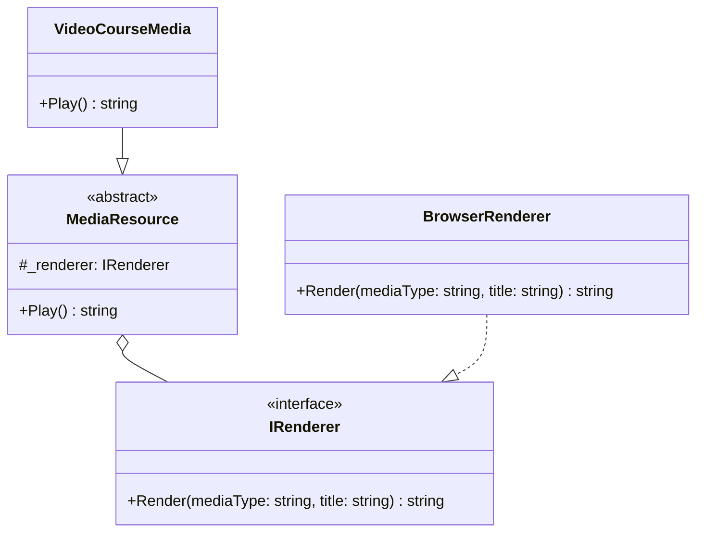
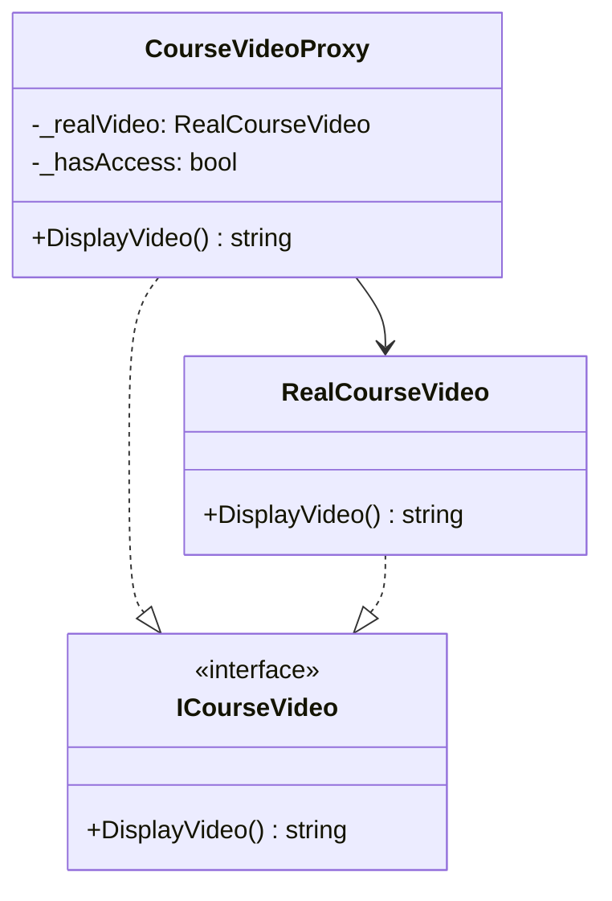

# Modele de Proiectare Structurale - Laboratorul 4

Acest document explică detaliat cele trei modele de proiectare structurale implementate în proiectul *E-learning Platform*: **Adapter**, **Composite** și **Façade**.

---

## 1. Paternul Adapter (Adaptor)

### Definiție
Paternul Adapter permite colaborarea între clase care au interfețe incompatibile. Acesta acționează ca o punte între două obiecte, transformând interfața unei clase (Adaptee) într-o interfață pe care o așteaptă clientul (Target).

### Problema Rezolvată
În platforma noastră, am dorit să integrăm mai multe gateway-uri de plată externe (ex: PayPal și Stripe). Fiecare serviciu are propriul său SDK și interfețe diferite (PayPal are o metodă `MakePayment(decimal)`, în timp ce Stripe are o metodă `ChargePayment(double)` care întoarce un string). Fără un Adaptor, codul nostru ar deveni strâns cuplat de aceste biblioteci externe, fiind necesară modificarea logicii de business la fiecare adăugare sau schimbare de API.

### Principiul SOLID Asociat
- **Single Responsibility Principle (SRP):** Adaptorul este responsabil doar de transformarea interfeței, separând logica de conversie de logica principală de business.
- **Open/Closed Principle (OCP):** Putem introduce noi adaptoare (ex: GooglePayAdapter) în program fără a modifica codul clientului existent.
- **Dependency Inversion Principle (DIP):** Clientul depinde de abstractizarea `IPaymentProcessor`, nu de implementările concrete ale API-urilor.

### Diagrama UML (Explicativă)


**Explicarea Diagramei:**
- `Client`: (Sistemul nostru) apelează interfața `IPaymentProcessor`.
- `IPaymentProcessor`: Interfața pe care o așteptăm în sistem.
- `PayPalAdapter`: Implementează `IPaymentProcessor` și conține o instanță de `PayPalApi`.
- `PayPalApi` (Adaptee): Clasa incompatibilă pe care dorim să o integrăm. `PayPalAdapter` "traduce" apelul `ProcessPayment` în `MakePayment`.

### Cod Implementat și Explicare

**Target Interface (`IPaymentProcessor.cs`):**
Interfața comună pe care o va folosi restul platformei.
```csharp
public interface IPaymentProcessor
{
    bool ProcessPayment(decimal amount);
}
```

**Adaptee (`StripeApi.cs` și `PayPalApi.cs`):**
Codi incompatibil, adesea dintr-o librărie third-party.
```csharp
public class StripeApi
{
    public string ChargePayment(double totalAmount)
    {
        return totalAmount > 0 ? "SUCCESS" : "FAILURE";
    }
}
```

**Adapter (`StripeAdapter.cs` și `PayPalAdapter.cs`):**
Adaptorul primește Adaptee-ul prin constructor și realizează conversia de tipuri și parametri.
```csharp
public class StripeAdapter : IPaymentProcessor
{
    private readonly StripeApi _stripeApi;

    public StripeAdapter(StripeApi stripeApi)
    {
        _stripeApi = stripeApi;
    }

    public bool ProcessPayment(decimal amount)
    {
        // Conversie double la decimal și de la string la bool
        string response = _stripeApi.ChargePayment((double)amount);
        return response == "SUCCESS";
    }
}
```

---

## 2. Paternul Composite (Compozit)

### Definiție
Paternul Composite permite compunerea obiectelor în structuri arborescente (de tip arbore) pentru a reprezenta ierarhii parțiale sau întregi. Aceasta permite clienților să trateze în mod uniform obiectele individuale și compozițiile de obiecte.

### Problema Rezolvată
Platforma noastră vinde atât cursuri individuale (`Course`), cât și pachete de cursuri (ex: "Categoria Web Dev"). Dacă un client cumpără un pachet întreg, calculul prețului ar necesita verificări de tip `if (item is CourseCategory)` pentru a aduna recursiv prețurile. Paternul Composite rezolvă asta asigurându-se că atât cursurile individuale, cât și pachetele implementează aceeași interfață care poate calcula prețul.

### Principiul SOLID Asociat
- **Liskov Substitution Principle (LSP):** Clientul poate folosi interfața de bază `ICourseComponent` fără să știe dacă apelează o frunză (un curs simplu) sau un nod (o categorie de cursuri). Ambii substituenți se comportă corect.
- **Open/Closed Principle (OCP):** Putem adăuga structuri noi de clase în ierarhie fără să alterăm clasele deja existente sau codul clientului.

### Diagrama UML (Explicativă)


**Explicarea Diagramei:**
- `Client`: Interacționează cu elementele ierarhiei doar prin interfața abstractă `ICourseComponent`.
- `ICourseComponent` (Component): Interfața comună tuturor elementelor.
- `Course` (Leaf): Elementul de bază al ierarhiei. Acesta nu are copii, deci returnează prorpiul său preț. Metodele de `Add/Remove` aruncă excepții.
- `CourseCategory` (Composite): Elementul complex ce conține o listă de `ICourseComponent`. Apelează operației pe toți copiii săi și agrega rezultatele.

### Cod Implementat și Explicare

**Component Interface (`ICourseComponent.cs`):**
```csharp
public interface ICourseComponent
{
    string Title { get; }
    decimal GetPrice();
    void Display(int depth);
    void Add(ICourseComponent component);
    void Remove(ICourseComponent component);
}
```

**Leaf (`Course.cs`):**
Returnează propriul său preț. Este incapabil să stocheze alte entități.
```csharp
public class Course : ICourseComponent
{
    public decimal GetPrice() { return BasePrice; } // bazat pe Strategy
    
    public void Add(ICourseComponent component)
    {
        throw new NotSupportedException("Cannot add a component to a leaf course.");
    }
    // ...
}
```

**Composite (`CourseCategory.cs`):**
Acționează ca un un container. `GetPrice()` este delegat către copii recursiv.
```csharp
public class CourseCategory : ICourseComponent
{
    private readonly List<ICourseComponent> _children = new List<ICourseComponent>();
    public string Title { get; private set; }

    public void Add(ICourseComponent component) { _children.Add(component); }

    public decimal GetPrice()
    {
        // Se însumează prețul tuturor copiilor din ierarhie
        return _children.Sum(c => c.GetPrice());
    }
    // ...
}
```

---

## 3. Paternul Façade (Fațadă)

### Definiție
Paternul Façade oferă o interfață simplificată la o colecție de clase, servicii sau la un subsistem complex (sau chiar multiple subsisteme). Fațada ascunde logica complicată structurală de la client.

### Problema Rezolvată
Atunci când un student achiziționează un curs, sistemul trebuie să îndeplinească automat trei pași independenți:
1. Procesarea banilor.
2. Salvarea înscrierii studentului la curs.
3. Trimiterea unui email de confirmare către student.
Dacă ne bazăm pe nivelul UI (ex. controllere) să apeleze toate aceste trei servicii (`IPaymentProcessor`, `EnrollmentManager`, `EmailService`), UI-ul devine strâns cuplat și cunoaște prea mult din logica internă a sistemului. Paternul Façade mută această mediere într-un loc simplu.

### Principiul SOLID Asociat
- **Single Responsibility Principle (SRP):** Facade permite subsistemelor să se ocupe strict de specializările lor, în timp ce Facada este singura responsabilă cu orchestrarea macro a pașilor pentru achiziționarea unui curs.
- **Dependency Inversion Principle (DIP):** Clientul UI poate depinde exclusiv de o singură interfață sau clasă (Facada) în loc să fie cuplat la `IPaymentProcessor`, `EnrollmentManager`, și `INotificationService`.

### Diagrama UML (Explicativă)


**Explicarea Diagramei:**
- `Client`: (Ex. Frontend-ul). Cheamă direct doar pe `CourseEnrollmentFacade`. Astfel, clientul nu știe despre existența componentelor interne (`Payment`, `Enrollment`).
- `CourseEnrollmentFacade`: Acționează ca un dirijor (orchestrator). Preia inputul sumarizat și execută pașii necesari pe entitățile ascunse din ierarhia sa de dependințe.

### Cod Implementat și Explicare

**Façade Class (`CourseEnrollmentFacade.cs`):**
Această clasă integrează Adapter-ul (PaymentProcessor) și Serviciul general de înregistrări într-un singur flux simplu returnând un `bool` (Success/Failed).
```csharp
public class CourseEnrollmentFacade
{
    private readonly IPaymentProcessor _paymentProcessor;
    private readonly EnrollmentManager _enrollmentManager;

    public CourseEnrollmentFacade(IPaymentProcessor paymentProcessor, EnrollmentManager enrollmentManager)
    {
        _paymentProcessor = paymentProcessor;
        _enrollmentManager = enrollmentManager;
    }

    public bool BuyCourse(Student student, Course course)
    {
        // Pasul 1: Procesăm plata via subsistemul Payment (folosind și Adapter pattern aici)
        decimal price = course.GetPrice(); // Poate fi un Composite (o categorie de cursuri)
        bool paymentSuccess = _paymentProcessor.ProcessPayment(price);

        if (!paymentSuccess)
        {
            return false;
        }

        // Pasul 2: Procesăm înregistrarea (care pe plan intern trimite un email/Warning)
        _enrollmentManager.Enroll(student, course);

        return true;
    }
}
```
Clientul final doar instanțiază și folosește o singură linie pentru tot procesul:
`facade.BuyCourse(student, "Curs Python 101");`


---

## 4. Paternul Flyweight (Muscă)

### Definiție
Paternul Flyweight permite reducerea consumului de memorie prin partajarea cât mai multor stări comune între mai multe obiecte, în loc ca fiecare obiect să stocheze aceleași date. 

### Problema Rezolvată
În componenta de editor de text integrată direct în modulele cursului (ex: suport de curs online), dorim să afișăm mii de caractere scrise de profesori. Instanțierea unui obiect dedicat pentru fiecare caracter afișat ar consuma enorm de multă memorie. Folosind un `CharacterFactory`, platforma instanțiază obiectul pentru litera 'A' o singură dată și îl refolosește oriunde 'A' apare în text, pasându-i coordonatele, mărimea și fontul doar în momentul desenării (extrinsic state).

### Principiul SOLID Asociat
- **Single Responsibility Principle (SRP):** Clasa Flyweight (`CharacterFlyweight`) stochează starea intrinsecă (simbolul curent), în timp ce starea extrinsecă vine prin metode.

### Diagrama UML (Explicativă)


**Explicarea Diagramei:**
- `CharacterFactory`: Gestionează un dicționar de obiecte `CharacterFlyweight`. Când clientul cere un caracter, fabrica verifică dacă există și îl returnează.
- `ICharacterFlyweight`: Interfața comună pe care o folosesc obiectele flyweight.
- `CharacterFlyweight`: Stochează starea intrinsecă (simbolul curent). Metoda `Draw` preia starea extrinsecă la apelare.

### Cod Implementat și Explicare

**Flyweight Interface (`ICharacterFlyweight.cs`):**
```csharp
public interface ICharacterFlyweight
{
    void Draw(string font, int size);
}
```

**Concrete Flyweight (`CharacterFlyweight.cs`):**
Obiectul stochează caracterul (intrinsec) și primește detalii de randare (extrinsec) în momentul desenării. Acesta nu își modifică niciodată simbolul după instanțiere.
```csharp
public class CharacterFlyweight : ICharacterFlyweight
{
    private readonly char _symbol;
    public CharacterFlyweight(char symbol) { _symbol = symbol; }

    public void Draw(string font, int size)
    {
        Console.WriteLine($"Drawing '{_symbol}' in {font} at size {size}");
    }
}
```

**Flyweight Factory (`CharacterFactory.cs`):**
Asigură unicitatea instanțelor, refolosind obiectele deja create.
```csharp
public class CharacterFactory
{
    private readonly Dictionary<char, ICharacterFlyweight> _characters = new();

    public ICharacterFlyweight GetCharacter(char symbol)
    {
        if (!_characters.ContainsKey(symbol))
        {
            _characters[symbol] = new CharacterFlyweight(symbol);
        }
        return _characters[symbol];
    }
}
```

---

## 5. Paternul Decorator (Decorator)

### Definiție
Paternul Decorator permite atașarea dinamică a unor noi responsabilități (comportamente) la un obiect, fără a modifica definiția clasei originale (folosind compoziția în loc de moștenire).

### Problema Rezolvată
Sistemul de notificări folosea un serviciu de bază pentru e-mail. Profesorii și studenții au solicitat să primească și alerte prin SMS sau Push Notifications. În loc să creăm clase complexe de tip `EmailAndSmsNotificationService`, abstractizăm comportamentul într-un `NotificationDecorator`. Astfel, putem "înfășura" notificarea de bază cu un comportament suplimentar de SMS la rulare.

### Principiul SOLID Asociat
- **Open/Closed Principle (OCP):** Putem adăuga un alt Decorator (ex: `PushNotificationDecorator`) fără a atinge implementarea de bază `EmailService`.
- **Single Responsibility Principle (SRP):** Decoratorul de SMS face doar trimiterea de SMS, lăsând obiectul înfășurat să-și trimită singur e-mailul.

### Diagrama UML (Explicativă)


**Explicarea Diagramei:**
- `INotificationService`: Interfața comună atât pentru serviciul de bază, cât și pentru decoratori.
- `EmailService`: Componenta de bază pe care o "decorăm".
- `NotificationDecorator`: Păstrează o referință internă la `INotificationService` și delegează apelurile default către aceasta.
- `SmsNotificationDecorator`: Suprascrie metoda `Notify` pentru a adăuga comportamentul specific (SMS) după delegarea către comportamentul de bază.

### Cod Implementat și Explicare

**Component Interface and Base (`INotificationService.cs`, `EmailService.cs`):**
```csharp
public interface INotificationService { void Notify(string to, string message); }
```

**Base Decorator (`NotificationDecorator.cs`):**
Implementează interfața dar și conține o instanță prin compoziție.
```csharp
public abstract class NotificationDecorator : INotificationService
{
    protected readonly INotificationService _notifier;
    protected NotificationDecorator(INotificationService notifier) { _notifier = notifier; }

    public virtual void Notify(string to, string message)
    {
        _notifier.Notify(to, message);
    }
}
```

**Concrete Decorator (`SmsNotificationDecorator.cs`):**
Adaugă trimiterea adiacentă de SMS.
```csharp
public class SmsNotificationDecorator : NotificationDecorator
{
    public SmsNotificationDecorator(INotificationService notifier) : base(notifier) { }

    public override void Notify(string to, string message)
    {
        base.Notify(to, message); // Execută comportamentul de bază (Email)
        SendSms(to, message);     // Adaugă comportamentul nou (SMS)
    }

    private void SendSms(string to, string message) { /* Trimite SMS */ }
}
```

---

## 6. Paternul Bridge (Punte)

### Definiție
Paternul Bridge separă o abstractizare de implementarea sa, pentru ca cele două tabere să poată varia (pot fi extinse) independent.

### Problema Rezolvată
Avem materiale de completare în cursuri (`VideoCourseMedia`, `AudioCourseMedia`), și dorim să le redăm pe mai multe dispozitive (`BrowserRenderer`, `MobileRenderer`). Fără Punte, ar trebui să creăm ierarhii complexe (ex. `BrowserVideoMedia`). Bridge tratează conținutul (`MediaResource`) independent de redarea lui (`IRenderer`).

### Principiul SOLID Asociat
- **Open/Closed Principle (OCP):** Putem adăuga medii de redare (ex. `TvRenderer`) sau resurse (ex. `LiveStreamMedia`) fără să ne afectăm codul extern.
- **Dependency Inversion Principle (DIP):** Abstractizarea (`MediaResource`) depinde de interfața `IRenderer`.

### Diagrama UML (Explicativă)


**Explicarea Diagramei:**
- `MediaResource`: Abstractizarea de nivel înalt. Depinde de interfața Implementor-ului (`IRenderer`).
- `VideoCourseMedia`: O extensie a abstractizării ce specifică un anumit pilon conceptual.
- `IRenderer`: Interfața ce definește implementarea tehnică de bază a mediului de redare.
- `BrowserRenderer`: Concrete implementor pentru Browser.

### Cod Implementat și Explicare

**Implementor (`IRenderer.cs`, `BrowserRenderer.cs`):**
```csharp
public interface IRenderer
{
    string Render(string mediaType, string title);
}

public class BrowserRenderer : IRenderer
{
    public string Render(string mediaType, string title)
    {
        return $"Playing {mediaType} '{title}' in Web Browser.";
    }
}
```

**Abstraction (`MediaResource.cs`):**
Primește referința prin constructor (injeție de dependență).
```csharp
public abstract class MediaResource
{
    protected IRenderer _renderer;
    public string Title { get; set; }

    protected MediaResource(IRenderer renderer, string title)
    {
        _renderer = renderer;
        Title = title;
    }
    public abstract string Play();
}
```

**Refined Abstraction (`VideoCourseMedia.cs`):**
Cere preluarea acțiunii prin implementatorul său (Renderer).
```csharp
public class VideoCourseMedia : MediaResource
{
    public VideoCourseMedia(IRenderer renderer, string title) : base(renderer, title) { }
    public override string Play() 
    { 
        return _renderer.Render("Video", Title); 
    }
}
```

---

## 7. Paternul Proxy (Surogat)

### Definiție
Proxy-ul acționează ca un intermediar / surogat care controlează accesul către un alt obiect real (util pentru constrângeri de securitate, lazy-loading etc).

### Problema Rezolvată
Avem fișiere video (sau teste premium). Un Protection Proxy (`CourseVideoProxy`) interceptează încercarea studentului de a reda videoclipul și verifică dacă are achiziția validă (hasAccess=true). Același Proxy funcționează și ca un Virtual Proxy: instanțierea clasei greoaie `RealCourseVideo` este amânată doar momentul în care verificarea are un succes valid.

### Principiul SOLID Asociat
- **Open/Closed Principle (OCP):** Putem adăuga o nouă verificare de securitate sau logici de cache fără să alterăm clasa care deține logica de redare `RealCourseVideo`.
- **Single Responsibility Principle (SRP):** Verificarea permisiunilor este strict responsabilitatea Proxy-ului.

### Diagrama UML (Explicativă)


**Explicarea Diagramei:**
- Ambele părți (Proxy și RealCourseVideo) implementează aceeași interfață `ICourseVideo`.
- Clientul cheamă Proxy-ul, interacționând cu el ca și cum e obiectul real.
- Proxy-ul face validările și apoi la un apel acceptat creează / delegează la `RealCourseVideo`.

### Cod Implementat și Explicare

**Subject Interface (`ICourseVideo.cs`):**
```csharp
public interface ICourseVideo
{
    string DisplayVideo();
}
```

**Real Subject (`RealCourseVideo.cs`):**
Clasa costisitoare care preia redarea videoclipului din baza de date sau CDN.
```csharp
public class RealCourseVideo : ICourseVideo
{
    private readonly string _videoUrl;
    public RealCourseVideo(string videoUrl) { _videoUrl = videoUrl; }
    public string DisplayVideo() { return $"Playing video located at {_videoUrl}"; }
}
```

**Proxy Subject (`CourseVideoProxy.cs`):**
Verifică autorizarea și amână instanțierea `RealCourseVideo`.
```csharp
public class CourseVideoProxy : ICourseVideo
{
    private RealCourseVideo? _realVideo;
    private readonly string _videoUrl;
    private readonly bool _hasAccess;

    public CourseVideoProxy(string videoUrl, bool hasAccess)
    {
        _videoUrl = videoUrl;
        _hasAccess = hasAccess;
    }

    public string DisplayVideo()
    {
        if (!_hasAccess) 
            return "Access Denied.";

        if (_realVideo == null)
            _realVideo = new RealCourseVideo(_videoUrl);

        return _realVideo.DisplayVideo();
    }
}
```

